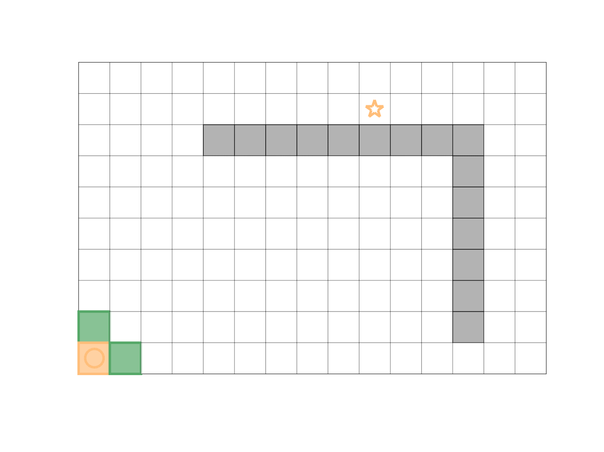

# A* Algorithm in MATLAB

Try the A* path-finding algorithm in MATLAB with the 2D map.



:warning: **This is an in-progress study project. Codes here may give a reasonable result, but I haven't fully checked.**

## Introduction

The `demo.m` shows a simple example of A* algorithm. You just create a `GridMap` with matrix of costs. Given the start and goal `Node` (matrix index), the `AStar` or `redblobAStar` should be capable to find the costless path and show the result.

```MATLAB
clear;clc
close all

% Generate a map with random costs
mapdata = zeros(10, 15)+0.5;
mapdata(3, 5:13) = 100;
mapdata(3:9, 13) = 100;
map = GridMap(mapdata, 90);

% Set start and goal position (matrix index)
start = Node(10, 1);
goal = Node(2, 10);

% Call AStar to find the costless path
astar_path = AStar(map, start, goal, 'showprocess', true, 'framerate', 0.1, 'costcolor', [1 1 1], 'costalpha', 0.7);
fprintf('AStar total cost: %.2f\n', astar_path(end, 3));
```


## References

I started from the blog [Introduction to the A* Algorithm](https://www.redblobgames.com/pathfinding/a-star/introduction.html), which is very interesting with interactive visual explanations. But there are [some changes](https://www.redblobgames.com/pathfinding/a-star/implementation.html#algorithm) compared with the original version.

If you want to dive into the original algorithm, you may want to read the paper [A Formal Basis for the Heuristic Determination of Minimum Cost Paths](https://ieeexplore.ieee.org/abstract/document/4082128).
